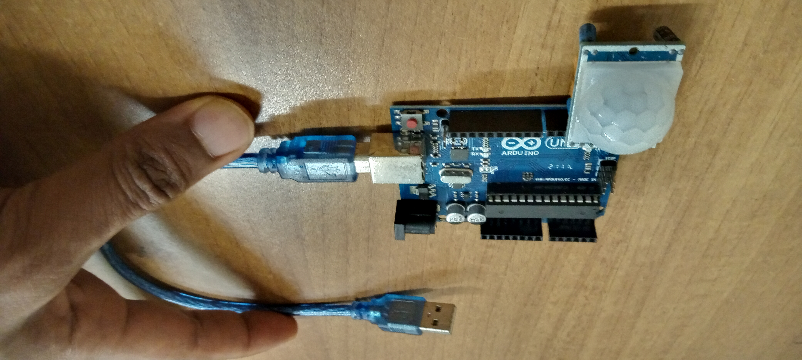
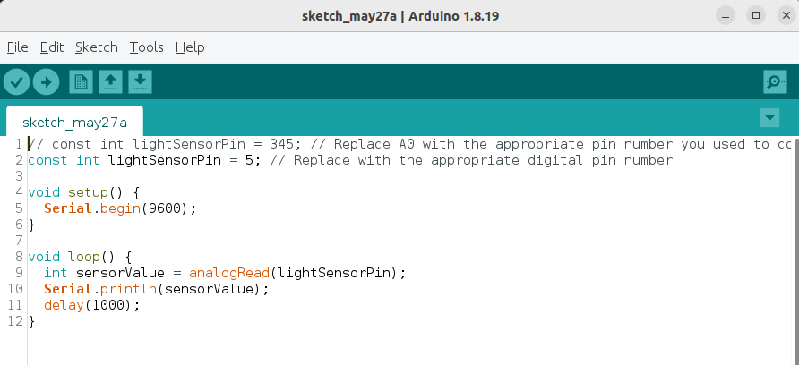
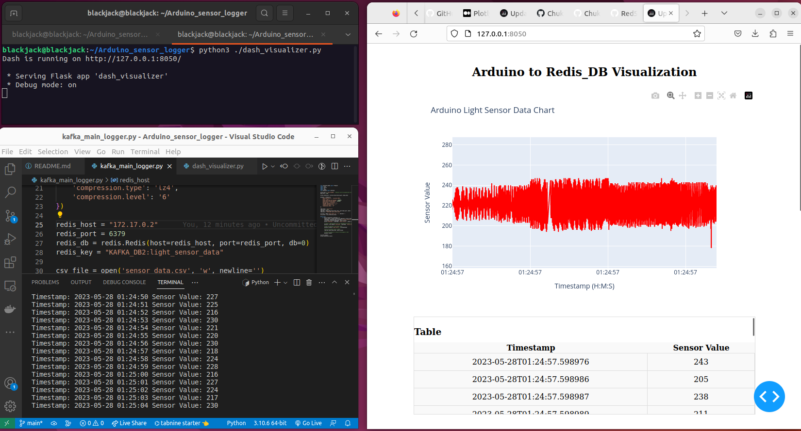

# Arduino Sensor Logger

The script is a visualization tool for real-time Arduino sensor data using a message broker (Kafka) and a data store (Redis). It leverages the Dash framework to create an interactive web-based dashboard that provides visualizations and insights into the sensor readings. The project employs Kafka as a message broker to facilitate the seamless transfer of sensor data from the Arduino device to the script. By using Kafka, the script can handle high volumes of data and ensure reliable message delivery, enabling real-time monitoring and analysis of the sensor readings.

Redis, on the other hand, is utilized as a data store for storing the sensor data received from Kafka. Redis is an in-memory database that offers fast read and write operations, making it suitable for real-time applications. The script stores the sensor values in Redis, allowing efficient retrieval and processing of the data for visualization purposes. Redis's key-value store architecture provides a convenient way to store and retrieve sensor readings, enabling quick access to historical data and supporting real-time updates of the visualizations.

The project integrates Kafka as a message broker for seamless data transfer and leverages Redis as a fast and efficient data store. Together, these technologies enable real-time visualization and analysis of Arduino sensor data, empowering users to gain insights and make informed decisions based on the real-time sensor readings.

<br>

### The device specs.

Arduino board type: 'Arduino Uno'
Arduino version: '1.8.19'

Arduino board info: 

`BN: Arduino Uno`
`VID: 2341`
`PID: 0043`
`SN: 55736303939351106231`

<br>

 <br>
*Arduino UNO kit used for the project. Notice the dome-shaped light sensor attached to the board*
<br>

 <br>
*Arduino UNO kit's Code Editor*
<br>


### Installation steps:

- Install Arduino firmware to our Ubuntu computer.

	`sudo apt install arduino`

- Give 'dialout' elevated permissions.

	`sudo usermod -aG dialout blackjack`

- Install PySerial: used to establish a serial connection and communicate with the Arduino from Python.

	`pip install pyserial`

- Install libcanberra-gtk-module.	

	`sudo apt-get install libcanberra-gtk-module`

- Install dash and redis in Python

	`pip install dash redis`


### Run this Arduino Code in the Arduino code editor

	// const int lightSensorPin = 345; // Replace A0 with the appropriate pin number you used to connect the OUT pin of the light sensor
	const int lightSensorPin = 5; // Replace with the appropriate digital pin number

	void setup() {
	Serial.begin(9600);
	}

	void loop() {
	int sensorValue = analogRead(lightSensorPin);
	Serial.println(sensorValue);
	delay(1000);
	}


### Run Kafka and ZooKeeper Containers in Docker

We used ```docker pull ubuntu/kafka:3.1-22.04_beta``` to download the Kafka Image specific to Ubuntu 22.04 from https://hub.docker.com/r/ubuntu/kafka Then we do a docker run to run the kafka container.

    docker run -d --name kafka-container -e TZ=UTC -p 9092:9092 -e ZOOKEEPER_HOST=host.docker.internal ubuntu/latest

If Kafka can't find ZooKeeper which it needs to run, you might need to expose the Kafka port to the host network. You can do this by adding the --network host option to the docker run command:

    docker run -d --name kafka-container --network host -e TZ=UTC -e KAFKA_ADVERTISED_HOST_NAME=host.docker.internal -v volume-Arduino:/Arduino_sensor_logger  -e KAFKA_ADVERTISED_PORT=9092 -e ZOOKEEPER_HOST=host.docker.internal ubuntu/kafka:latest

### Create Kafka topic called "Light-Sensor" 

Lets create a Kafka topic specifically to collect the logs from our light sensor connected to Arduino.

	kafka-topics.sh --create --bootstrap-server localhost:9092 --replication-factor 1 --partitions 10 --topic Light-Sensor


### How the Data generated looks in Python Console

```

Timestamp: 2023-05-28 01:35:02 Sensor Value: 227
Timestamp: 2023-05-28 01:35:03 Sensor Value: 228
Timestamp: 2023-05-28 01:35:04 Sensor Value: 216
Timestamp: 2023-05-28 01:35:05 Sensor Value: 223
Timestamp: 2023-05-28 01:35:06 Sensor Value: 231
Timestamp: 2023-05-28 01:35:07 Sensor Value: 218
Timestamp: 2023-05-28 01:35:08 Sensor Value: 220
Timestamp: 2023-05-28 01:35:09 Sensor Value: 231
.............................................

```

### Streaming the Arduino light sensor logs to Confluent Kafka (our message broker service).

Here, we use the code in the python file called `kafka_main_logger.py` below to stream our logs from Kafka, then domicile it in Redis for further analysis.

```
from confluent_kafka import Producer
import json
import serial
import csv
import redis
from datetime import datetime

serial_port = '/dev/ttyACM0'  # Replace with the appropriate serial port on your computer
baud_rate = 9600

serial_connection = serial.Serial(serial_port, baud_rate)

producer = Producer({
    'bootstrap.servers': 'localhost:9092',
    'acks': 'all',
    'queue.buffering.max.messages': 2000000,
    'queue.buffering.max.kbytes': 3000000,
    'partitioner': 'consistent',
    'message.send.max.retries': '5',
    'request.required.acks': '-1',
    'compression.type': 'lz4',
    'compression.level': '6'
})

redis_host = "172.17.0.2"
redis_port = 6379
redis_db = redis.Redis(host=redis_host, port=redis_port, db=0)
redis_key = "KAFKA_DB2:light_sensor_data"

csv_file = open('sensor_data.csv', 'w', newline='')
csv_writer = csv.writer(csv_file)

while True:
    if serial_connection.in_waiting > 0:
        sensor_value = serial_connection.readline().strip().decode('utf-8')
        timestamp = datetime.now().strftime('%Y-%m-%d %H:%M:%S')  # Get current timestamp
        csv_writer.writerow([timestamp, sensor_value])
        print("Timestamp:", timestamp, "Sensor Value:", sensor_value)

        # Create a JSON payload with the timestamp and sensor value
        payload = json.dumps({'timestamp': timestamp, 'sensor_value': sensor_value}).encode('utf-8')

        # Send the payload to the Kafka topic
        producer.produce('Light-Sensor', value=payload)

        # Store the sensor value in Redis
        redis_db.rpush(redis_key, sensor_value)

        # Flush the producer to ensure the message is sent
        producer.flush()

csv_file.close()
serial_connection.close()

```

### Visualizing the logs with DASH framework

We use the code in the python file called `dash_visualizer.py` below to visualize the logs streamed from the light sensors to Kafka broker and then to Redis (a NoSQL DB)

```
import time
from datetime import datetime
import dash
from dash import dcc
from dash import html
from dash.dependencies import Input, Output
import plotly.graph_objs as go
import redis

# Redis configuration
redis_host = '172.17.0.2'
redis_port = 6379
redis_db = redis.Redis(host=redis_host, port=redis_port, db=0)
redis_key = 'KAFKA_DB2:light_sensor_data'

# Create a Dash app
app = dash.Dash(__name__)

# Define CSS styles
styles = {
    'container': {
        'width': '80%',
        'margin': 'auto',
        'padding': '20px'
    },
    'title': {
        'text-align': 'center',
        'font-size': '24px',
        'margin-bottom': '20px'
    },
    'chart-container': {
        'margin-bottom': '20px'
    },
    'table-container': {
        'height': '200px',
        'overflow-y': 'scroll',
        'border': '1px solid #ddd',
        'margin-bottom': '20px'
    },
    'table': {
        'width': '100%',
        'border-collapse': 'collapse'
    },
    'table-header': {
        'background-color': '#f9f9f9',
        'font-weight': 'bold',
        'text-align': 'center',
        'border-bottom': '1px solid #ddd'
    },
    'table-cell': {
        'border': '1px solid #ddd',
        'padding': '8px',
        'text-align': 'center'
    },
    'table-row': {
        'background-color': '#f9f9f9'
    }
}

# Create a function to generate the table HTML
def generate_table(data):
    header = html.Tr([
        html.Th('Timestamp', style=styles['table-header']),
        html.Th('Sensor Value', style=styles['table-header'])
    ])
    rows = [
        html.Tr([
            html.Td(row['Timestamp'], style=styles['table-cell']),
            html.Td(row['Sensor Value'], style=styles['table-cell'])
        ], style=styles['table-row']) for row in data
    ]
    return html.Table([header] + rows, style=styles['table'])

# Define the layout of the app
app.layout = html.Div(
    style=styles['container'],
    children=[
        html.H1('Arduino to Redis_DB Visualization', style=styles['title']),
        html.Div(
            style=styles['chart-container'],
            children=[
                dcc.Graph(id='sensor-graph')
            ]
        ),
        html.Div(
            style=styles['table-container'],
            children=[
                html.H3('Table', style={'margin-bottom': '10px'}),
                html.Div(id='table-container')
            ]
        ),
        html.Div(
            style=styles['chart-container'],
            children=[
                dcc.Graph(id='area-chart')
            ]
        ),
        html.Div(
            style=styles['chart-container'],
            children=[
                dcc.Graph(id='donut-chart')
            ]
        ),
        dcc.Interval(
            id='interval-component',
            interval=1000,  # Refresh interval in milliseconds
            n_intervals=0
        )
    ]
)

# Update the graph, table, area chart, and donut chart with new data
@app.callback(
    [
        Output('sensor-graph', 'figure'),
        Output('table-container', 'children'),
        Output('area-chart', 'figure'),
        Output('donut-chart', 'figure')
    ],
    Input('interval-component', 'n_intervals')
)
def update_data(n):
    # Fetch data from Redis
    redis_data = redis_db.lrange(redis_key, 0, -1)

    # Parse and store data in lists
    timestamps = []
    sensor_values = []
    for data in redis_data:
        data = data.decode('utf-8')
        try:
            sensor_value = int(data)
            timestamps.append(datetime.now())  # Use current timestamp
            sensor_values.append(sensor_value)
        except ValueError:
            print('Invalid data:', data)

    # Create a scatter trace for the line chart
    scatter_trace = go.Scatter(
        x=timestamps,
        y=sensor_values,
        mode='lines',
        name='Sensor Data',
        line=dict(color='red', width=2),  # Customize line color and width
        marker=dict(symbol='circle', size=8),  # Customize marker symbol and size
        hovertemplate='Timestamp: %{x}<br>Sensor Value: %{y}',  # Customize hover template
        hoverlabel=dict(bgcolor='white', font=dict(color='black'))  # Customize hover label
    )

    # Create the figure for the line chart
    line_fig = go.Figure(data=[scatter_trace])

    # Update the layout for the line chart
    line_fig.update_layout(
        title="Arduino Light Sensor Data Chart",
        xaxis_title='Timestamp (H:M:S)',
        yaxis_title='Sensor Value',
        xaxis=dict(
            range=[timestamps[0], timestamps[-1]],  # Set the range of x-axis
            tickformat='%H:%M:%S'  # Format x-axis tick labels
        ),
        autosize=True  # Automatically adjust graph size
    )

    # Generate the table data
    table_data = []
    for timestamp, sensor_value in zip(timestamps, sensor_values):
        table_data.append({'Timestamp': timestamp, 'Sensor Value': sensor_value})

    # Generate the table HTML
    table_html = generate_table(table_data)

    # Create the figure for the area chart
    area_fig = go.Figure(data=[go.Scatter(x=timestamps, y=sensor_values, fill='tozeroy')])

    # Update the layout for the area chart
    area_fig.update_layout(
        title="Sensor Data Area Chart",
        xaxis_title='Timestamp (H:M:S)',
        yaxis_title='Sensor Value',
        xaxis=dict(
            range=[timestamps[0], timestamps[-1]],  # Set the range of x-axis
            tickformat='%H:%M:%S'  # Format x-axis tick labels
        ),
        autosize=True  # Automatically adjust graph size
    )

    # Create the figure for the donut chart
    donut_fig = go.Figure(data=[go.Pie(labels=['Sensor 1', 'Sensor 2'], values=[30, 70])])

    # Update the layout for the donut chart
    donut_fig.update_layout(
        title="Sensor Distribution",
        autosize=True  # Automatically adjust graph size
    )

    return line_fig, table_html, area_fig, donut_fig

# Run the app
if __name__ == '__main__':
    app.run_server(debug=True)


```


 <br>
*Left> Python printing the logs from the light sensor to the console. Right> Real-time charting of Redis DB where logs are sent.*
<br>


